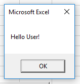

# "Self-aware Button" Exercise

## Learning Objectives

Familiarize yourself with some introductory VBA topics:

  + Objects, Object Properties, Object-oriented Programming
  + The `CommandButton` ActiveX Control
  + Defining and Invoking [Sub-procedures](/notes/visual-basic/sub-procedures.md)
  + [Comments](/notes/visual-basic/comments.md)
  + Function Scope
  + ActiveX Control `_Click()` Functions
  + [The `MsgBox` Function](/notes/visual-basic/functions/msg-box.md)
  + Declaring and Setting [Variables](/notes/visual-basic/variables.md)
  + Variable Scope
  + [Math Operations](https://msdn.microsoft.com/en-us/library/aa445143.aspx)

## Challenge

**Make a button that when clicked alerts the user how many times it has been clicked.**

## Walk-through

<hr><hr><hr><hr>
Spoiler Alert!
<hr><hr><hr><hr>

### Creating a Button

"Developer" > "Insert" > "CommandButton"

You will now find yourself in "Design Mode" and your pointer has become a cross-hair. Click and hold and drag to define the size of the button.

Exit from "Design Mode" and try to click on the button. What happens? Nothing yet.

### Responding to Button Clicks

Get back into "Design Mode". And double-click the button.

You should be redirected to a new window displaying the VBA Code Editor. Take a look at the VBA code that was defined for you:

```vb
Private Sub CommandButton1_Click()

End Sub
```

Instead of double-clicking on the button, you could alternatively define this function by writing it yourself, as long as it is named exactly the same: `CommandButton1_Click()`. Click-event functions for ActiveX Controls follow a specific naming convention, which is to append `_Click()` to the name of the ActiveX Control, which is in this case `CommandButton1`.

Exit from "Design Mode" and try to click on the button. What happens? Nothing yet. Because we haven't written any code inside the click function. This would be the perfect time and place to invoke a message box:

```vb
Private Sub CommandButton1_Click()
  MsgBox("Hello User!")
End Sub
```

Exit from "Design Mode" and try to click on the button. What happens?



Oh Yeah!

### Counting Clicks

Define a new integer variable (perhaps named `ClickCount`) to store the number of clicks. Each time the button is clicked, increment the value of the variable by one. Include the variable's value in the message box prompt.

[Solution](counting-clicks-solution.md).
