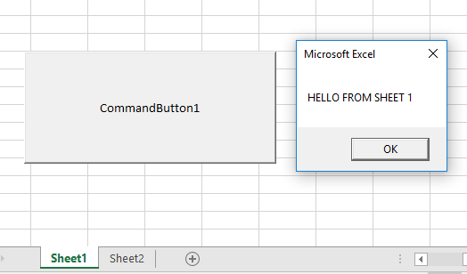
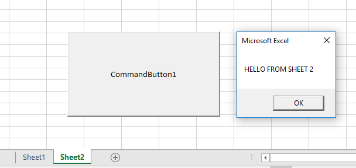
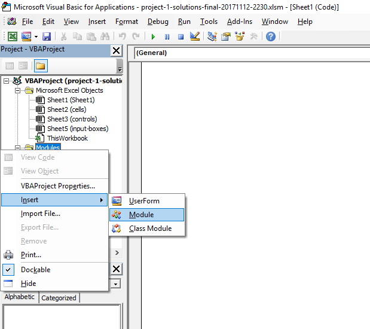
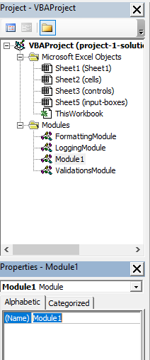

# VBA Language Overview

## Modules and Application Architecture

Reference:

  + [Modules](https://msdn.microsoft.com/en-us/library/aa240820)
  + [Access Levels (`Public`, `Private`, etc.)](https://docs.microsoft.com/en-us/dotnet/visual-basic/programming-guide/language-features/declared-elements/access-levels)
  + [Scope and Visibility](https://msdn.microsoft.com/en-us/vba/language-reference-vba/articles/understanding-scope-and-visibility)

**Modules** allow the programmer to organize and share code across sheets and with each other. You can download open source modules [like this one](https://github.com/VBA-tools/VBA-JSON), or create your own.

Notice in the Visual Basic Editor window, the Project Explorer pane is separated into sub-folders, including "Microsoft Excel Objects" and "Modules". The "Microsoft Excel Objects" sub-folder usually contains one or more files which each correspond with a worksheet or workbook. Usually when you start writing VBA code, you're writing in a file which corresponds to a given worksheet. Any `Private` procedures in this file can be accessed only within that file's scope.

To enable a procedure to be accessed by other sheets, move it into a module and change its access level from `Private` to a `Public`.

### Module Example

Code in `Module1`:

```vb
Public Sub DisplayMessage(ByVal MyMessage As String)
    MsgBox(MyMessage)
End Sub
```

Code in `Sheet1`:

```vb
Private Sub CommandButton1_Click()
    Call DisplayMessage("HELLO FROM SHEET 1")
End Sub
```

Code in `Sheet2`:

```vb
Private Sub CommandButton1_Click()
    Call DisplayMessage("HELLO FROM SHEET 2")
End Sub
```





### Creating Modules

To create a new Module, from the Visual Basic Editor find "Modules" in the Project Explorer pane, right click on it, then select "Insert" > "Module".



To optionally rename a module, highlight it from the Modules folder and press the "F4" key to reveal its properties. Then change the "Name" property as desired.


