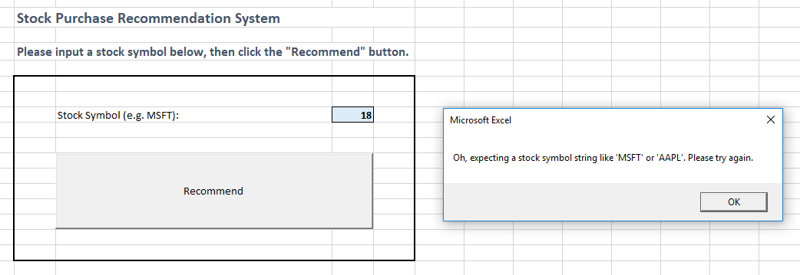
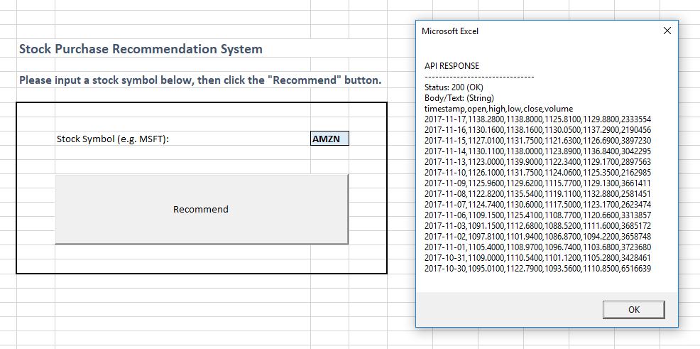
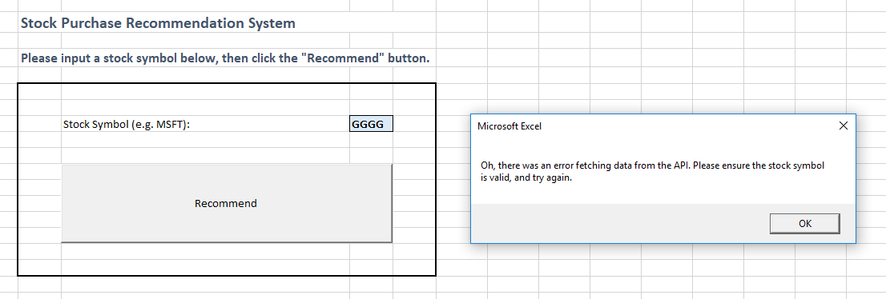
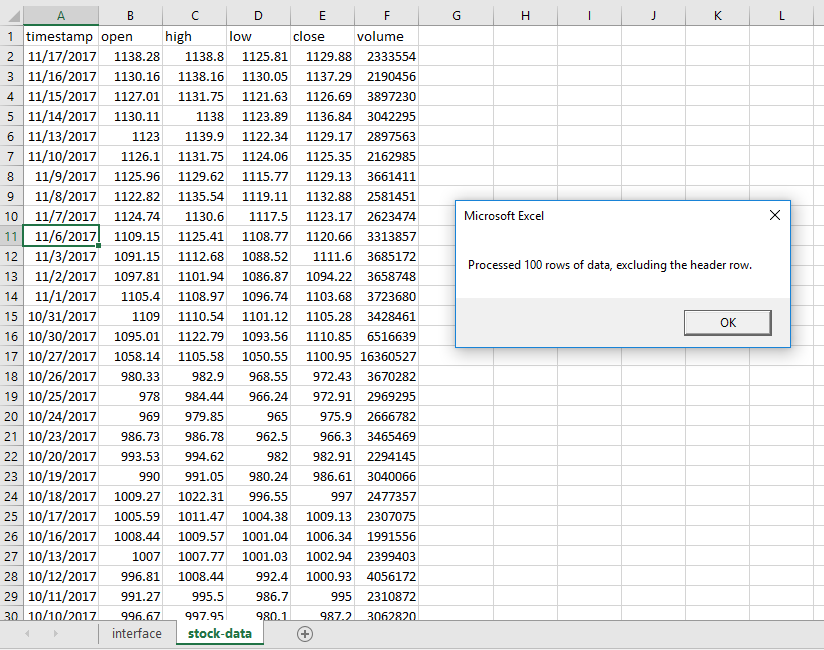

# Project 2 Checkpoints

This document provides a progression of sequential checkpoints to help focus your development efforts.

Regardless of whether you would like your final project solution to process a single stock symbol at a time, or multiple stock symbols at a time, you are recommended to start with the simpler "Single Symbol Solution" first. Then you can optionally apply your learnings to the more complex "Multiple Symbol Solution".

## Single Symbol Solution

### Checkpoint 1: Capture User Inputs

  1. Decide how you would like to capture the user's stock symbol input. Cell Value? Input Box? Some other mechanism?
  2. Create a simple user interface with the desired input mechanism and an ActiveX Command Button to initiate the recommendation process.
  3. Write VBA code to capture the user input on button click and optionally display it in a message box as feedback to the user.

### Checkpoint 2: Validate User Inputs

At this point it is not feasible to know whether or not the stock symbol input represents a real publicly-traded company. But do your best to perform some basic preliminary validations on the stock symbol, like making sure it is not numeric in nature, and making sure it resembles a stock symbol (i.e. less than around 6 characters, and no spaces).

If the input doesn't pass validations, display a message box to the user to help them fix the error, and stop the program's execution. Otherwise, optionally temporarily display a message box to let the user know the input has passed initial validations.

> NOTE: Prevention of unnecessary requests helps save resources (i.e. computer processing time and costs) for both your program and the API server. This respectful best practice is most likely appreciated by the API developers :smiley:.

### Checkpoint 3: Compile Request URL

  1. If you haven't already reviewed the [Alpha Vantage API documentation](https://www.alphavantage.co/documentation/), take a few moments to do so. Familiarize yourself with the available API functions (e.g. `TIME_SERIES_INTRADAY`, `TIME_SERIES_DAILY`, `TIME_SERIES_DAILY_ADJUSTED`, etc.), as well as the available request parameters and example responses for each.
  2. Choose a request URL that you would like to start with. You are highly, highly, highly recommended to specify your desire for the response to be in CSV format.
  3. In your program, declare a new string variable called `RequestURL` assign its value to be a hard-coded representation of your chosen request URL.
  3. Feel free to move on to the next checkpoints using your hard-coded request URL. Later on, when you are ready, compile the request URL dynamically using a variable to represent the desired stock symbol. You are encouraged to abstract this dynamic URL-compilation logic into a function which accepts a stock symbol parameter and returns the corresponding request URL.

### Checkpoint 4: Request Stock Data

  1. If you have not already done so, configure Excel to use Microsoft WinHTTP Services.
  2. Use Microsoft WinHTTP Services to instantiate a new request object, and send the request.
  3. Optionally display the corresponding response in a message box or in cell values. Include the response status and the response text.

### Checkpoint 5: Handle Response Errors

  1. Try issuing a request using a stock symbol you know doesn't exist, maybe something like "OOPS" or "GGGG". See what kind of response comes back.
  2. Create a validation which determines whether the response is successful or not. It should parse the response text for some identifying characteristic that differentiates an error response from a successful response. Hint: perhaps use the `InStr()` function to check whether or not the response text includes the words "Error Message". If the response is an error, display a friendly error message and stop the program's execution. Otherwise allow the program to continue.

### Checkpoint 6: Write Response to Sheet

  1. Create a new sheet to store the historical price data. Name it something like "outputs" or "stock-data".
  2. Parse the response text, which will be a CSV formatted string as long as you made the proper request. Use loops and arrays to write the corresponding values to the output sheet.

### Checkpoint 7: Perform Calculations

  1. Prepare to test your program's ability to perform calculations using data from the output sheet. To avoid making unnecessary requests during this time, take a moment to comment-out the part of your code which issues the HTTP request. This will allow you to continue to test your program without straining the resources of the API server. Another friendly best practice that would be appreciated by the API developers. Don't worry, when you are done testing your calculations, you can un-comment the HTTP request logic.
  1. Programmatically read cell values from your output sheet to determine metrics such as the latest closing price, and any other information relevant to making a final recommendation.
  2. Optionally display these calculations in a message box.

### Checkpoint 8: Output Final Recommendation

  1. Use a message box or cell values to issue a recommendation conditionally based on the results of your calculations.

## Multiple Symbol Solution

TBA - see if you can demonstrate your ability to achieve the single symbol solution first.
